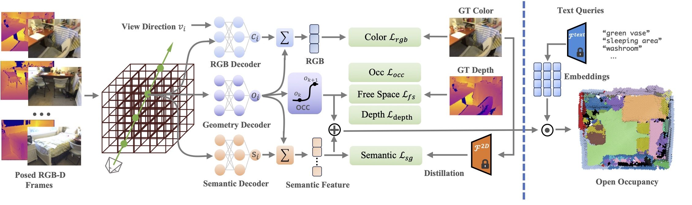

# OpenOcc: Open Vocabulary 3D Scene Reconstruction via Occupancy Representation
### [[Paper]](https://arxiv.org/abs/2403.11796) 

> [**OpenOcc: Open Vocabulary 3D Scene Reconstruction via Occupancy Representation**](https://arxiv.org/abs/2403.11796),            
> Haochen Jiang*, Yueming Xu*, Yihan Zeng, Hang Xu, Wei Zhang, Jianfeng Feng, Li Zhang  
> **IROS 2024**

**Official implementation of "OpenOcc: Open Vocabulary 3D Scene Reconstruction via Occupancy Representation".** 

## 🛠️ Pipeline
<div align="center">
  
</div><br/>

<!-- ## 🎥 Videos -->
<!-- ## 🎞️ Demo -->
## 🎥 Demo
[](https://www.youtube.com/embed/lxg5rSyJeac)

## ⚙️ Installation
Please follow the instructions below to install the repo and dependencies.

```bash
git clone git@github.com:fudan-zvg/OpenOcc.git
cd OpenOcc
```
### Install the environment
```bash
# Create conda environment
conda create -f environment.ymal
conda activate openocc
```
## 📂 Download Dataset & Data preprocessing
#### Matterport3D Dataset
Download Matterport3D dataset into `./data/Matterport3D` folder.
```
python data_download/download_mp.py
```

Generate CLIP features and GT semantic point cloud
```
python dataio/matterport_dataset.py
python script/generate_matterport_eval_data.py
```
semantic point cloud will be saved into `script/matterport_3d/label35`

## 🔄 Run
You can run OpenOcc using the code below:
```
python train_matterport.py
```
results will be saved in `./logs`

## 🔍 Evaluate
Evaluate the results and calculate mIoU and mAcc:
```
python evaluate_semantic_matterport.py
```

## 📜 BibTeX
```bibtex
@inproceedings{jiang2024openocc,
  title={OpenOcc: Open Vocabulary 3D Scene Reconstruction via Occupancy Representation},
  author={Jiang, Haochen and Xu, Yueming and Zeng, Yihan and Xu, Hang and Zhang, Wei and Feng, Jianfeng and Zhang, Li},
  booktitle={IEEE\RSJ International Conference on Intelligent Robots and Systems (IROS)},
  year={2024},
}
```

## Acknowledgement
Thanks to previous open-sourced repo: [Go-Surf](https://github.com/JingwenWang95/go-surf), [LeRF](https://github.com/kerrj/lerf)